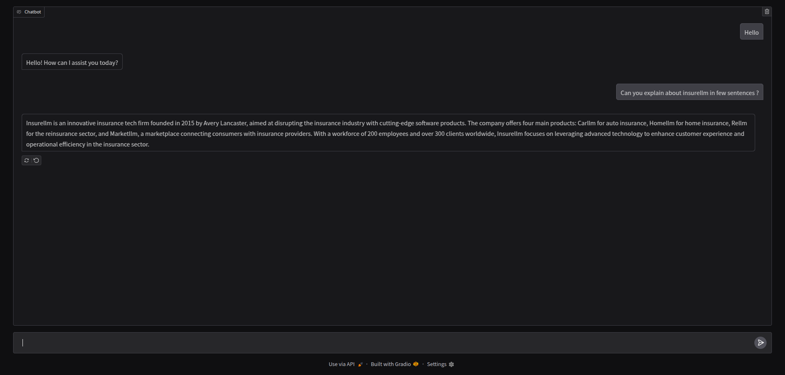

# Gradio RAG Chatbot using ChromaDB and OpenAI  

This project is a **Retrieval-Augmented Generation (RAG) chatbot** built using **Gradio** for the UI, **ChromaDB** as the vector database, and **OpenAI's GPT models** for response generation. It allows users to interact with an AI assistant that retrieves relevant context from stored knowledge before generating responses, improving accuracy and relevance.  

## 🚀 Features  
- **Gradio Interface** – Provides a user-friendly web-based chat UI.  
- **ChromaDB** – Stores and retrieves relevant document embeddings for context-aware responses.  
- **OpenAI API** – Enhances chatbot responses with state-of-the-art language models.  
- **Efficient RAG Pipeline** – Combines retrieval and generation for more informed conversations.  

## 🔧 How It Works  
1. **Load Documents** – Ingests and embeds text data into ChromaDB.  
2. **User Query** – Accepts input from the Gradio chat interface.  
3. **Context Retrieval** – Fetches relevant documents using ChromaDB.  
4. **Response Generation** – Uses OpenAI's model to generate a reply based on the retrieved context.  

This project is ideal for **AI-powered knowledge retrieval, customer support bots, and domain-specific chat applications.** 🚀  

## 🛠 Installation & Setup  
Before running the application, create a `.env` file from `.env.sample` and you will need to set the following environment variable to your .env file `OPENAI_API_KEY`

1. Clone the repository:  
   ```bash
   git clone https://github.com/smrussel/employdata-chatbot-rag-openai.git
   cd employdata-chatbot-rag-openai/
    ```
2. Install dependencies:
    ```bash
    pip install -r requirements.txt
    ```
3. Run the chatbot:
    ```bash
    python run.py
    ```

## 📌 Dependencies
    * Python 3.10
    * Gradio
    * ChromaDB
    * OpenAI API
    * Langchain 


## Gradio Chabot UI



## 📜 License
This project is licensed under the [MIT](LICENSE) License.